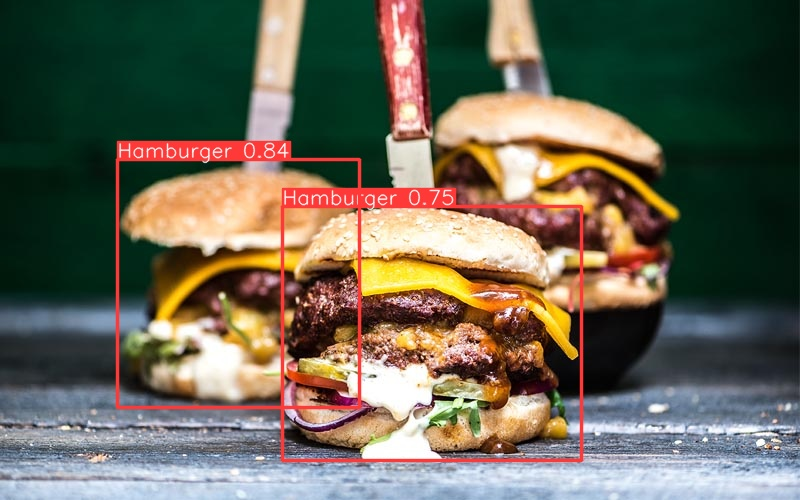
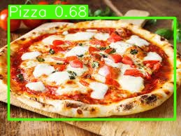

# YoloV5 custom model API
  

## Description

This is a fork of the Yolov5 repository (https://github.com/ultralytics/yolov5), repurposed as a Flask app where you can upload one picture and get a prediction on it.

The model used for inference has 6 classes, and has been trained on the YoloV5 medium sized model using pytorch with 200 images for each class. A GTX 2070 super was used for training.

Images obtained using OIDV6 toolkit for Yolo training (https://github.com/NanoCode012/OIDv6_ToolKit_Download_Open_Images_Support_Yolo_Format)

The 6 classes are foods:
Pizza, Hamburger, Banana, Pancake, Broccoli, French fries

## How to use

Install requirements.txt  
python detect-app.py  (It is running in development mode, move to another engine for production development)

Currently using a custom trained model for the 6 mentioned classes, but you can use any model you would like, just include the path to it in "detect-experimentation.py" weights.

## Roadmap

- [x] Custom model trained

- [x] Custom version of detect.py fromo YoloV5 generated

- [x] Flask app to use as an API

## Authors and acknowledgment
José María Sabater

